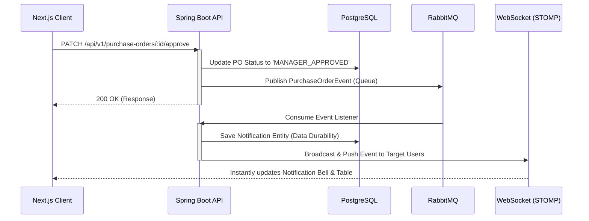

<h1 align="center">🛍️ Enterprise Purchase Order System</h1>

<p align="center">
  <i>A scalable, event-driven Fullstack Application designed for enterprise procurement workflows.</i>
  <br/>
  <br/>
  
  
  
  
  
  
</p>

---

## 🚀 Overview

This repository houses a **Production-Ready Purchase Order (PO) Management System** designed to streamline B2B procurement workflows. It enforces a strict, hierarchical approval chain *(Requester → Manager → Finance)* while providing real-time data synchronization utilizing an Event-Driven Architecture.

Built with performance, durability, and a clean modern UI in mind, this project serves as a showcase of enterprise-grade software engineering patterns.

### 🔗 Live Demo
> **[Insert Vercel / Live Deployment Link Here]**

---

## 🔥 Technical Highlights & Achievements

As a Fullstack engineering showcase, this project solves complex, real-world architectural challenges:

- **Asynchronous Event-Driven Notifications:** Instead of traditional API polling, the backend dispatches state-change events to a **RabbitMQ** Message Broker. A Spring Boot listener consumes these events, persists them to PostgreSQL for **guaranteed data durability**, and broadcasts them via **WebSockets (STOMP)** directly to the Next.js React client in real-time.
- **Enterprise-Grade Validation & Error Handling:** Strict `@Valid` enforcement combined with a custom `GlobalExceptionHandler` ensures secure and predictable REST API responses.
- **Modern Next.js Architecture:** Built with App Router (`app/`), leveraging **Zustand** for lightweight state management and optimized rendering (solving common React hydration mismatches on authenticated routes).
- **Responsive "Glassmorphic" Dashboard:** High-end aesthetic UI with custom Dropdown components, interactive Budget Utilization widgets, and contextual status visualizations.
- **Dynamic Burn Rate Calculation:** The dashboard intelligently calculates forecasted budget depletion dates and weekly burn rates dynamically based on organizational spending habits.

---

## 🏛️ System Architecture

The following diagram illustrates the decoupled, event-driven notification loop engineered to ensure complete data integrity even during user network loss.



---

## 💼 Core Business Workflow

1. **Request Creation:** Employees (`Role: REQUESTER`) draft Purchase Orders, deducting potential funds from their department's *Available* budget.
2. **Manager Review:** Department Heads (`Role: MANAGER`) receive real-time alerts. They review the budget utilization widget and can *Approve* or *Reject*.
3. **Financial Clearance:** If approved, the PO escalates to the Finance team (`Role: FINANCE`) for final disbursement verification and export to PDF.
4. **Real-time Feedback Loop:** At every stage, all involved parties receive targeted WebSocket notifications persisting in the background.

---

## 🛠️ Local Installation & Development

### Prerequisites
- Node.js 18+
- Java 17+ (JDK)
- Maven
- PostgreSQL (Running on `localhost:5432`)
- RabbitMQ (Running on `localhost:5672` or via CloudAMQP)

### Backend (Spring Boot)
```bash
cd backend
# Adjust database credentials & RabbitMQ URI in src/main/resources/application.yml
mvn clean install
mvn spring-boot:run
```

### Frontend (Next.js)
```bash
cd frontend
npm install
npm run dev
# App will run on http://localhost:3000
```
